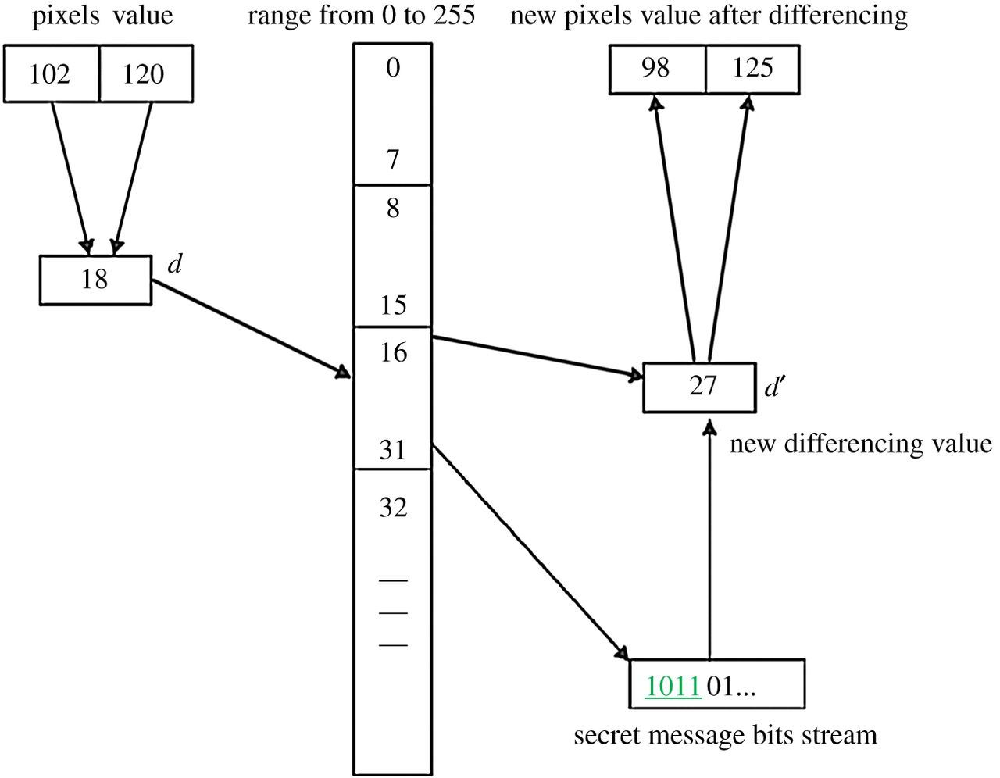

# Pixel Value Differencing (PVD) Steganography Presentation

### Least significant bit (LSB) steganography
Lab05 was based on LSB:
Set number of bits encoded in the smallest bits of a pixel or color channel.
In the lab, encoded smallest 2 bits of green value in pixels where red and blue values both had last 3 bits as `000`

However there are probles when only LSB is used
  - Inefficient in space, as it requires 4 pixels to encode a single byte
  - Can be trivially easy to detect, especially with tools such as stegsolve.

newmodifiedCat from website |  Area found by stegsolve
:-------------------------:|:-------------------------:
  |    

### PVD steganography
Instead of just changing the pixel values directly, we take the difference of two values and encode data into that instead
Uses the same principle of encoding data in least significant bits, but with a variable amount of bits encoded in each pixel or color channel
- "Smooth" areas with little differences between values are easier to detect with the naked eye, and so are encoded with less data
- "Rough" areas with greater differences between values are easier to detect with the naked eye, and so are encoded with more data
- This allows more data to be encoded without raising suspicion

PVD without overlap:
- Image is split into blocks of two each
  - We implemented this with individual pixels grayscale images
  - For a color image, could use diffrences between pixels on a single channel or multiple
  - Or alternatively diffrences between 2 channels on single pixels
- Based on the difference between values in the block, the number of encoded bits is determined

- Possibility of over/underflow is also checked
- Once the message is fully encoded, encode 0s in the remaining pixels

PVD with overlapping blocks:
- Color version is more flexible
- The other method we implemented, using 1 pixel and all 3 colors
- Essentially, individual pixels make up 2 blocks in this version: red-green and green-blue
  - These green values from each block are then averaged
  - The red and blue values are also adjusted to be the same distance from green as before averaging

- Overlapping blocks allows for maintained information density and efficiency with encoding
- Also, color images are less conspicuous than grayscale images when being sent, so the purpose of steganography is still fulfilled

-  `#1589F0`
