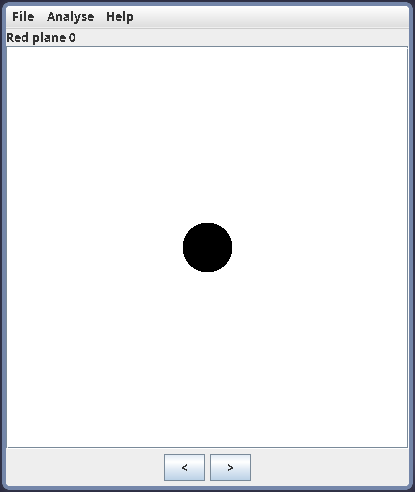
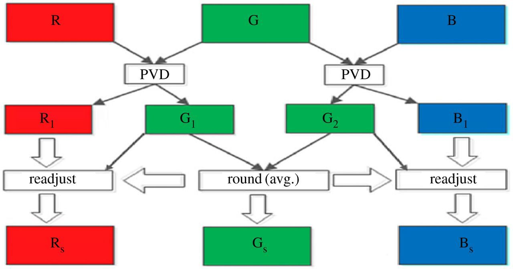

# Pixel Value Differencing (PVD) Steganography Presentation

## Least significant bit (LSB) steganography
Lab05 was based on LSB:

Set number of bits encoded in the smallest bits of a pixel or color channel.

In the lab, encoded smallest 2 bits of green value in pixels where red and blue values both had last 3 bits as `000`

However there are probles when only LSB is used
  - Inefficient in space, as it requires 4 pixels to encode a single byte
  - Can be trivially easy to detect, especially with tools such as stegsolve.

newmodifiedCat from website |  Area found by stegsolve
:-------------------------:|:-------------------------:
  |    

## PVD steganography
Instead of just changing the pixel values directly, we take the difference of two values and encode data into that instead.

For this example we used grayscale images, as each pixel is only one byte in value (RGB values are the same)

If we want to hide a message, we have to go through every two pixels inside a image.
1. Take the difference of the two pixels
2. Encode bits of the message into the difference (If none are left, encode zeroes)
3. Adjust the new pixel values using the new difference

This graph encodes bits 001 into two pixels
@ | 1st Value | 2nd Value | Difference
:--:|:--:|:--:|:--:
Before | 120 | 150 | 30 (11110) 
After  | 122 | 153 | 25 (11001)

### Encoding more bits
Two bits per block is too little, we can cram more bits without affecting the color too much.

Depending on how big the difference is, we can encode more bits into the difference.
- "Smooth" areas with little differences between values are easier to detect with the naked eye, and so are encoded with less data
- "Rough" areas with greater differences between values are harder to detect with the naked eye, and so are encoded with more data
- This allows more data to be encoded without raising suspicion

The amount of bits per difference is based on its range (lower,upper).
Index | Lower | Upper | Bits | Binary
:--:|:--:|:--:|:--:|:--:
0 | 0 | 7 | 3 | 00000xxx
1 | 8 | 15 | 3 | 00001xxx
2 | 16 | 31 | 4 | 0001xxxx
3 | 32 | 63 | 5 | 001xxxxx
4 | 64 | 127 | 6 | 01xxxxxx
5 | 128 | 255 | 7 | 1xxxxxxx

Using previous example, the difference of 30 is between 16-31, so we can encode 4 bits (0010).
@ | 1st Value | 2nd Value | Difference
:--:|:--:|:--:|:--:
Before | 120 | 150 | 30 (11110) 
After  | 126 | 158 | 18 (10010)

Before | After
:--:|:--:
 | 
 | 

### What about color images?
Color images are more flexible for how to encode images onto them, as there are three values on each pixel (alpha is useless to us)

### Buffer below dont look
PVD with overlapping blocks:
- Color version is more flexible
- The other method we implemented, using 1 pixel and all 3 colors
- Essentially, individual pixels make up 2 blocks in this version: red-green and green-blue
  - These green values from each block are then averaged
  - The red and blue values are also adjusted to be the same distance from green as before averaging

- Overlapping blocks allows for maintained information density and efficiency with encoding
- Also, color images are less conspicuous than grayscale images when being sent, so the purpose of steganography is still fulfilled

-  `#1589F0`
